

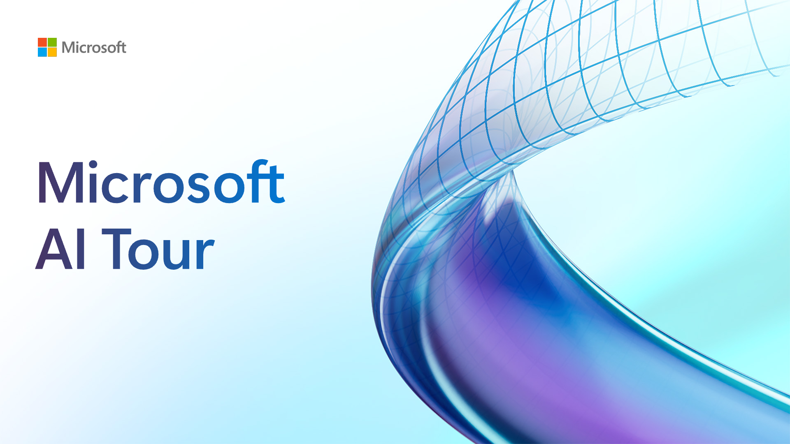

<!-- Image description: Microsoft AI Tour opening slide with the Microsoft logo, blue title text, and a translucent blue and violet ribbon graphic. -->

<!--
Speaker notes:

Timing: ~0:08 | Cumulative: ~0:08

Hi everyone, and welcome to Microsoft AI Tour. Thanks for spending this time with us. Let's get started.
-->

---

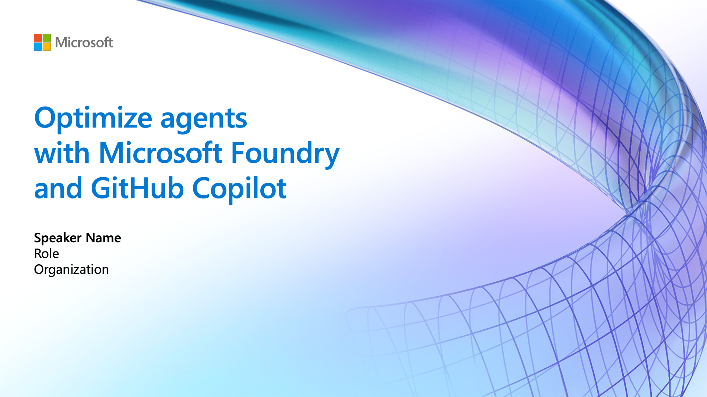

<!-- Image description: Title slide for "Optimize agents with Microsoft Foundry and GitHub Copilot," with placeholders for the speaker's name, role, and organization. -->

<!--
Speaker notes:

Timing: ~0:22 | Cumulative: ~0:30

Presenter guidance: Update this slide with your name and affiliation. Introduce yourself and the topic briefly.

Example: "I'm [speaker name], a [role] at [organization]. Today we're going to take an AI agent that works—but not well enough—and climb toward something better with Microsoft Foundry and GitHub Copilot. More importantly, we'll build a process you can repeat when the models, requirements, and problems inevitably change."
-->

---

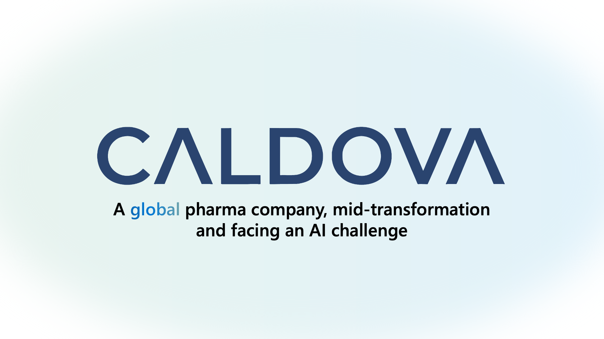

<!-- Image description: Introduction to Caldova, a fictional global pharmaceutical company undergoing transformation and facing an AI challenge. -->

<!--
Speaker notes:

Timing: ~0:25 | Cumulative: ~0:55

Presenter guidance: Introduce Caldova as fictional and establish the business problem. Keep the company background brief.

Meet Caldova, a fictional global pharmaceutical company in the middle of a big transformation. They've built an AI travel concierge for employees. And the first version works—which is great. But "it works" turns out to be a very low bar. The concierge also has to follow policy, respond quickly, and run at a cost the business can defend. That's the tension we're going to work through today.
-->

---

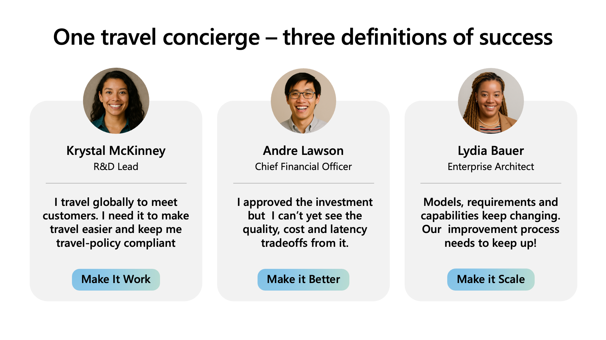

<!-- Image description: Three persona columns introduce Krystal, an R&D lead; Andre, the CFO; and Lydia, an enterprise architect, along with how each defines success. -->

<!--
Speaker notes:

Timing: ~0:40 | Cumulative: ~1:35

Presenter guidance: Don't read every card verbatim. Introduce each person as a viewpoint the audience can recognize. Clarify that "scale" means scaling the improvement process, not traffic.

And, of course, everyone means something different by "success." Krystal is the traveler. She just wants useful help that keeps her within policy. Andre is the CFO. He wants to see the tradeoffs among quality, cost, and latency. And Lydia is the architect. She knows the models and requirements will keep changing, so the improvement process has to keep up. Those three people give us our journey: make it work, make it better, and make the process scale.
-->

---

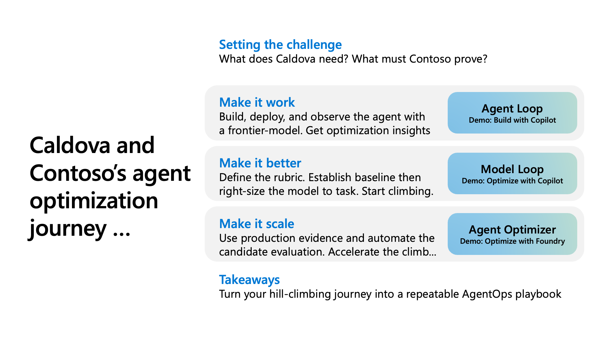

<!-- Image description: Session roadmap moving through setting the challenge, making the agent work, making it better, making it scale, and closing with takeaways. -->

<!--
Speaker notes:

Timing: ~0:35 | Cumulative: ~2:10

Presenter guidance: Use this as a route map, not a feature checklist. Frame the journey as one hill climb in three stages.

Contoso Travel is the fictional team building the concierge for Caldova. First, we'll get an agent into people's hands and see what it really does. Then we'll define the bar, measure our starting point, and try one change at a time. Some experiments will work. Some won't—and those failures matter too. Finally, we'll use Agent Optimizer to scale the climb. The goal isn't to crown one model today. It's to leave with an AgentOps playbook we can run again and again.
-->

---

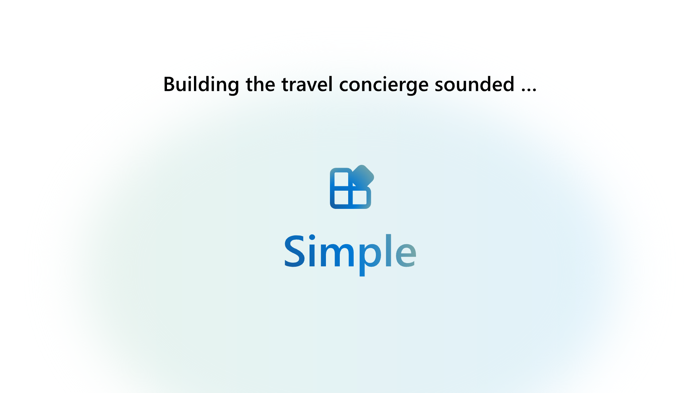

<!-- Image description: Minimal slide reading "Building the travel concierge sounded ... Simple," with a small blue application icon over a pale blue glow. -->

<!--
Speaker notes:

Timing: ~0:25 | Cumulative: ~2:35

Presenter guidance: Pause briefly after "simple," then shift from experimentation to production stakes.

At first, building the concierge sounded simple. Can the AI understand the request and give Krystal a useful answer? But we're not building a demo anymore. This agent sits inside a real workflow where policy, money, and employee trust are on the line. So "it works" is only the starting point.
-->

---

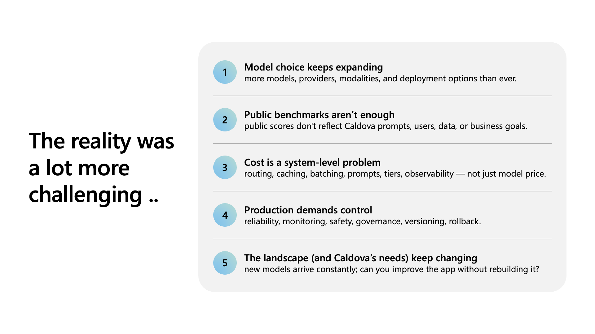

<!-- Image description: Challenge slide titled "The reality was a lot more challenging," listing model choice, benchmarks, cost, production demands, and a changing landscape. -->

<!--
Speaker notes:

Timing: ~0:40 | Cumulative: ~3:15

Presenter guidance: Frame the first three rows plus the changing landscape as four forces. "Production demands control" is the requirement those forces create.

Then reality shows up. There are more model choices every month, and today's favorite may not be tomorrow's. The best model on a public benchmark may not be the best one for your data, tools, and task. If the agent succeeds, usage grows—and so does the bill. Meanwhile, the prompts, context, models, and requirements keep changing underneath us. We can't deploy once and call it done. We need a system that lets us stay in control while the target keeps moving.
-->

---

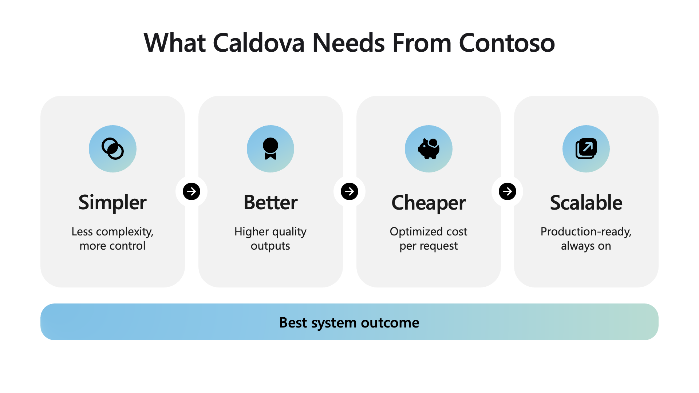

<!-- Image description: Four-column requirements table describing Caldova's goals for a simpler, better, cheaper, and scalable travel concierge. -->

<!--
Speaker notes:

Timing: ~0:25 | Cumulative: ~3:40

Presenter guidance: State the tensions, but don't reveal the product-to-problem mapping yet. Promise that the hero products will resolve them during the climb.

So here's Caldova's wish list: make the experience simpler while giving the business more control. Improve quality on Caldova's real workload. Lower the cost without quietly lowering the bar. And make the improvement process repeatable as everything changes. Easy, right? Those goals pull against each other. Our climb is about finding a better balance—and proving that it really is better.
-->

---

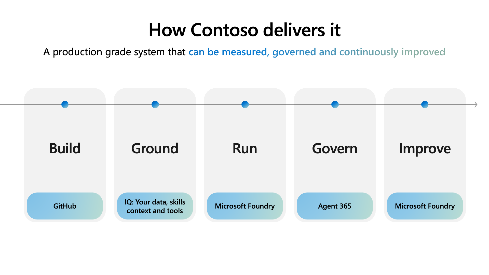

<!-- Image description: Five-stage process diagram showing how Contoso will build, ground, run, govern, and improve the travel concierge. -->

<!--
Speaker notes:

Timing: ~0:40 | Cumulative: ~4:20

Presenter guidance: Establish the complete lifecycle, then clearly scope this session to GitHub and Microsoft Foundry. Point attendees to other AI Tour sessions for grounding and governance.

This only works as a loop. Contoso builds in GitHub, grounds the agent in Caldova's data, context, skills, and tools, and runs it in Microsoft Foundry. Agent 365 provides the enterprise control plane to secure and govern it. Then the evidence from real use comes back into Foundry and shapes the next version. Today, we're zooming in on the GitHub and Foundry part of that story: build, observe, measure, and improve. Other AI Tour sessions go deeper on grounding and governance.
-->

---

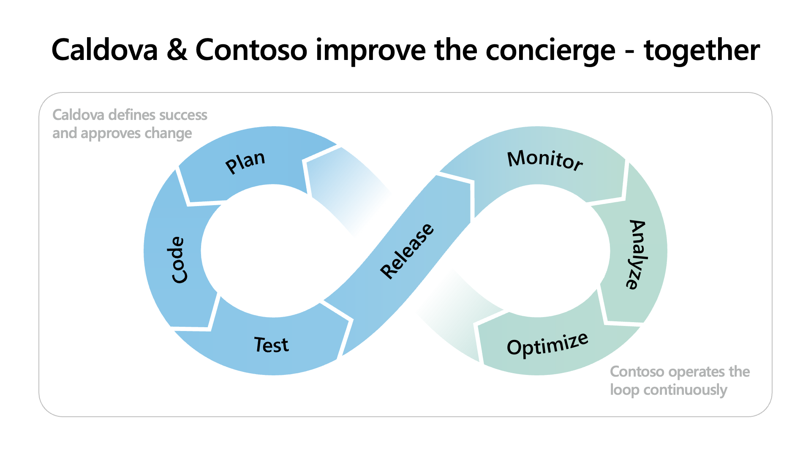

<!-- Image description: Collaboration loop in which Caldova defines success and approves experiments while Contoso operates the continuous improvement process. -->

<!--
Speaker notes:

Timing: ~0:35 | Cumulative: ~4:55

Presenter guidance: Introduce the operating model here. Trace the loop while preserving the shared-responsibility message.

Here's the working agreement. Caldova defines the outcome, decides what "good" looks like, and approves what goes live. Contoso keeps the loop moving: build and release, watch what happens, study the evidence, and create the next candidate. Then we go around again. Automation can do a lot of the legwork, but people still define the hill and decide which steps are worth keeping.
-->

---

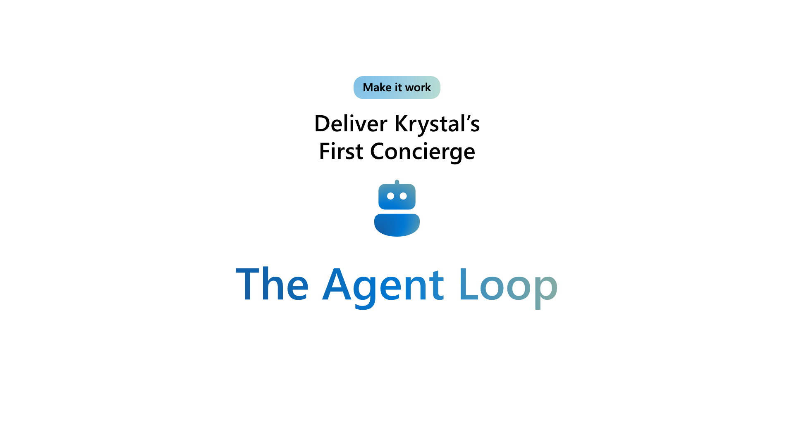

<!-- Image description: Section divider titled "Deliver Krystal's First Concierge" with "The Agent Loop" highlighted beneath it. -->

<!--
Speaker notes:

Timing: ~0:20 | Cumulative: ~5:15

Presenter guidance: Use this as a warm, clean handoff from the operating model into the first stakeholder and stage.

All right, enough diagrams. Let's put the loop to work. We start with Krystal. She isn't thinking about models or optimization strategies. She just wants to plan her trip, stay inside policy, and get reimbursed without turning travel into a second job.
-->

---

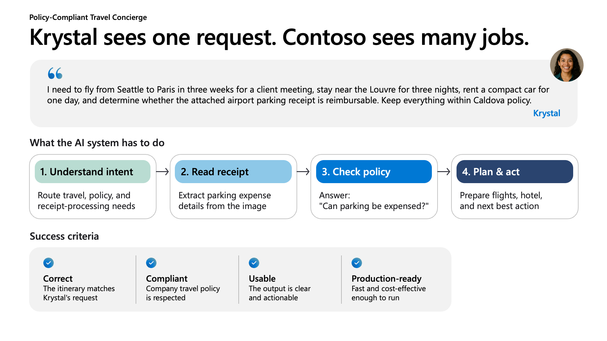

<!-- Image description: Krystal's detailed travel request broken into four tasks, alongside success criteria and relevant policy requirements. -->

<!--
Speaker notes:

Timing: ~0:35 | Cumulative: ~5:50

Presenter guidance: Contrast Krystal's natural request with the hidden chain of agent tasks. Move left to right through the workflow, then land on the success criteria.

To Krystal, this is one normal request: plan my Paris trip, deal with the car and receipt, and keep me inside policy. For the agent, it turns into a whole chain of jobs. Understand the request. Read an image. Find the right policy. Make a compliant decision. Call the right tools in the right order. What could possibly go wrong? Every handoff is a place to fail, which is why a polished final answer is not enough. The whole path has to work.
-->

---

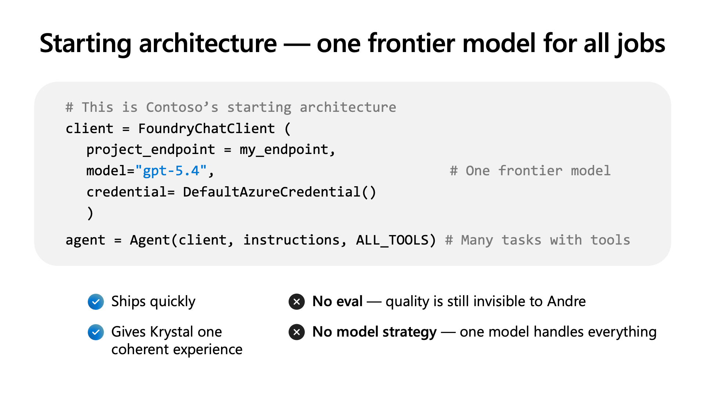

<!-- Image description: Baseline architecture diagram showing one frontier model, gpt-5.4, handling every concierge task, with code and design annotations. -->

<!--
Speaker notes:

Timing: ~0:30 | Cumulative: ~6:20

Presenter guidance: Deliver this with a "we've all been here" tone. The starting architecture is reasonable, not a mistake. Don't narrate the code line by line.

Instructor prep: Review `src/agent/main.py` for the agent construction and `src/agent/tools/definitions.py` for the registered tool definitions before delivering this slide.

And this is where many of us start. We do what we always do: pick a capable frontier model that can handle everything, and give it all the tools for the job. Honestly, that's a sensible first move. It ships quickly, and Krystal gets one coherent experience. But it comes with a familiar tradeoff: we haven't evaluated it, so quality is still invisible to Andre, and we don't yet have a model strategy. It's a perfectly good place to begin, just not where we want to stop.
-->

---

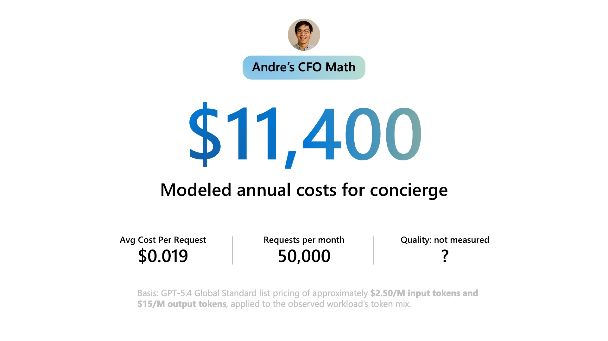

<!-- Image description: "Andre's CFO Math" summarizes estimated annual and per-request costs at 50,000 requests per month while noting that quality remains unmeasured. -->

<!--
Speaker notes:

Timing: ~0:30 | Cumulative: ~6:50

Presenter guidance: Tell this through Andre's reaction. Treat the dollar figure as an illustrative model based on the pricing shown on the slide, not a current quote. Pause after "Not bad" and again on the question mark.

And then Andre does the CFO math. He sees a cost of just under two cents per request, multiplies that by fifty thousand requests a month, and gets about eleven thousand four hundred dollars a year. Not bad. Maybe even a good investment. Then he asks the obvious question: what are we getting for that money? And right now, the honest answer is—we don't know. We haven't measured quality. A cheap answer that gets policy wrong isn't a bargain at all.
-->

---

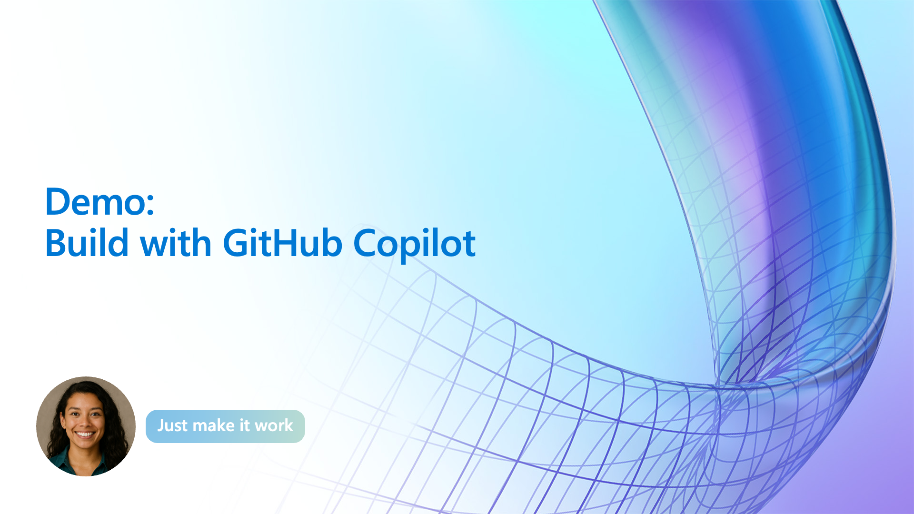

<!-- Image description: Demo divider titled "Build with GitHub Copilot" on a blue presentation background. -->

<!--
Speaker notes:

Timing: ~0:25 | Cumulative: ~7:15

Presenter guidance: Keep this transition quick. If using the recorded path, have `CLIP01-RUN` ready on the next slide.

Time to find out whether our sensible starting point actually makes Krystal happy. Copilot will help us turn the requirements into a hosted agent and deploy the first version. Then the guessing stops. Once people start using it, traces will show us what the agent does well, where it gets stuck, and what we should improve next. Let's see what happens.
-->

---

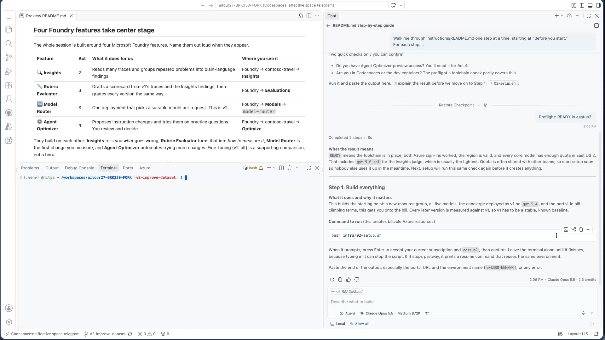

<!-- Image description: Visual Studio Code screenshot showing the repository guide, four highlighted Microsoft Foundry features, and setup guidance for the demo. -->

<!--
Speaker notes:

Timing: ~0:45 | Cumulative: ~8:00

Presenter guidance: Play `CLIP01-RUN` and narrate over it. Use the added time to orient the audience before playback and pause on the completed environment afterward. The clip is sped up; actual cloud provisioning takes longer and creates billable resources.

Play [CLIP01-RUN](../videos/CLIP01-RUN.mp4).

This is where Copilot earns its keep. We start in VS Code with one guided request, and a lot happens behind the scenes. Microsoft Foundry skills and tooling scaffold the hosted agent, provision the resources and model deployments, and bring the employee portal online. Work that normally spans several tools becomes one clear, repeatable flow. And just like that, we have something Krystal can actually try.
-->

---

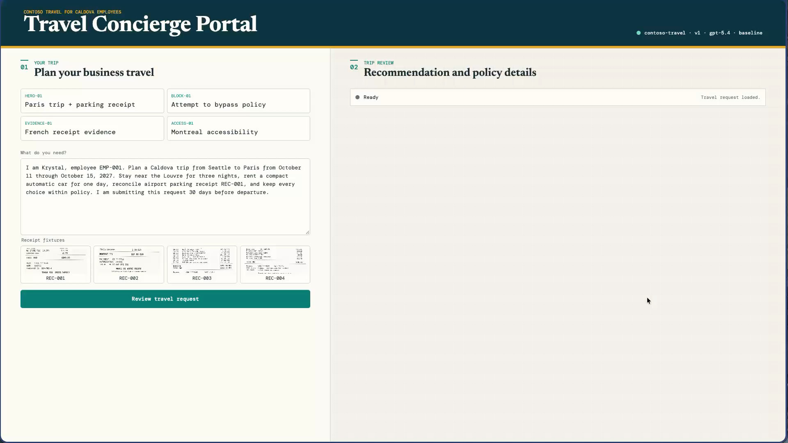

<!-- Image description: Travel concierge portal showing the v1 agent, sample trip scenarios, receipt fixtures, and policy-aware response interface. -->

<!--
Speaker notes:

Timing: ~1:15 | Cumulative: ~9:15

Presenter guidance: Play `CLIP02-PORTAL` and narrate over it. Don't read the responses. Use the added time to let Krystal's failed booking land, then contrast it with the successful policy refusal and receipt task.

Play [CLIP02-PORTAL](../videos/CLIP02-PORTAL.mp4).

Here comes the first reality check. We load Krystal's request, the agent works through the trip, and then—the booking doesn't happen. It can't prove that the policy check passed. Not the ending Krystal wanted. But honestly, this is useful. The agent isn't simply "bad." It correctly refuses an explicit attempt to bypass policy, and it can read and translate a French receipt for expensing. Now we have something much better than a demo that looked fine: we have real evidence of what works, what fails, and where to look next.
-->

---

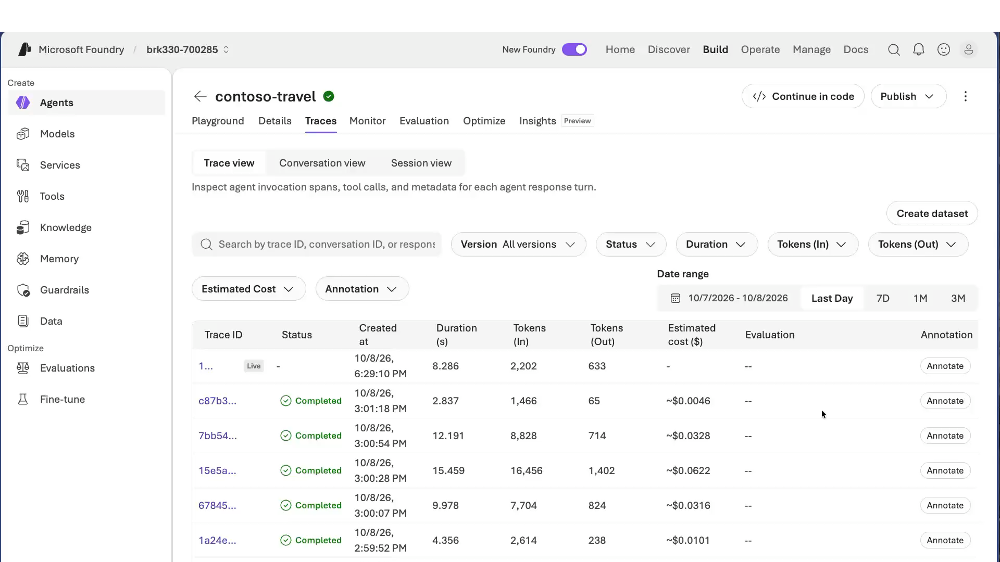

<!-- Image description: Microsoft Foundry trace view showing an agent invocation, its execution details, and telemetry for inspecting the response path. -->

<!--
Speaker notes:

Timing: ~1:00 | Cumulative: ~10:15

Presenter guidance: Play `CLIP03-TRACES` and narrate with curiosity. Pause after "What happened?" Use the added time to inspect one decisive step and ask the audience what they would check next. Current Microsoft Learn guidance says tracing is generally available for prompt and hosted agents; Trace Replay remains preview.

Play [CLIP03-TRACES](../videos/CLIP03-TRACES.mp4).

So... what happened? The portal gave us the ending: Krystal's trip wasn't booked. But it didn't give us the story. Trace Replay lets us rewind the run. Every model decision and tool call appears as a step, with its timing and token usage. Click any step and we can see exactly what went in and what came back. Then we scrub through the timeline until we find the moment the run took a wrong turn. Instead of guessing why the answer failed, we can watch the evidence unfold.
-->

---

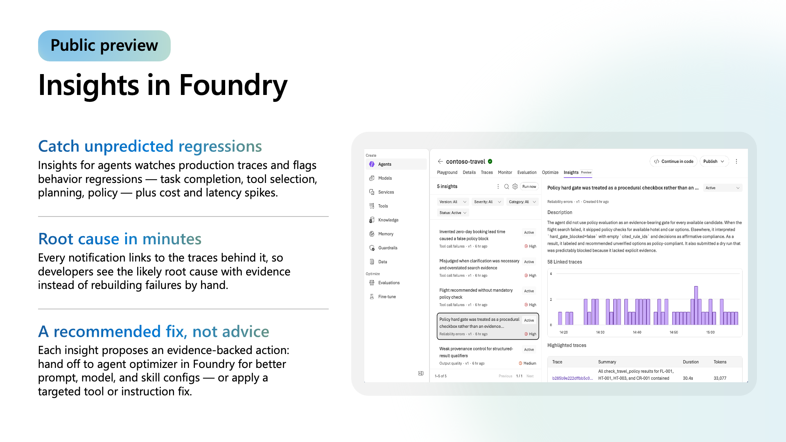

<!-- Image description: Agent Insights overview connecting repeated trace evidence to regression detection, root-cause findings, and recommended fixes. -->

<!--
Speaker notes:

Timing: ~1:00 | Cumulative: ~11:15

Presenter guidance: Play `CLIP04-QUESTIONS` and narrate over it. Use the added time to connect the batch of questions to the pattern Insights later finds. Insights in Foundry is currently preview; findings and proposed fixes still require human review.

Play [CLIP04-QUESTIONS](../videos/CLIP04-QUESTIONS.mp4).

One trace can help us solve one mystery. But none of us wants to open hundreds of traces one at a time. So we give our first agent a bunch of questions and let its habits show. As those traces pile up, Insights in Foundry does three useful things for us: it catches unexpected regressions, helps us find the likely root cause, and recommends a next step. In our case, fifty-eight traces told us the agent was treating policy compliance like a checkbox, not a hard gate that required evidence. Now we don't just have a feeling that something is wrong. We have a pattern, the evidence behind it, and a place to start fixing it.
-->

---

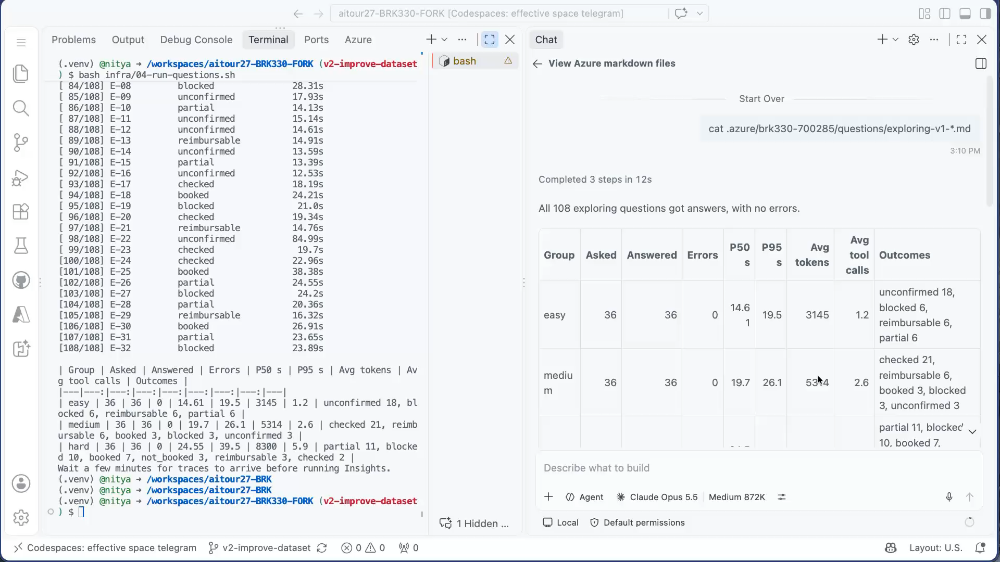

<!-- Image description: Terminal summary of 108 exploring-question runs, with outcome, latency, token, and tool-use results grouped by difficulty. -->

<!--
Speaker notes:

Timing: ~1:20 | Cumulative: ~12:35

Presenter guidance: Play `CLIP05-INSIGHTS` and narrate over it. Use the added time to pause on the five patterns, then ask which finding the audience would tackle first. The cloud analysis can take longer than this edited recording. Insights in Foundry is currently preview.

Play [CLIP05-INSIGHTS](../videos/CLIP05-INSIGHTS.mp4).

So how do we get Insights from all those traces? Copilot to the rescue again. It helps us start the run, and Foundry gathers and analyzes the evidence. Now this is the moment I love. We started with more than a hundred traces—far too much for any person to read one by one. Insights turns all that noise into five clear patterns. It tells us what changed, why it may have happened, and where the evidence is. Suddenly, strange behavior isn't a mystery anymore. It's something we can work on. And look—it even recommends what to do next. Isn't that amazing? We still make the decision, but we're no longer starting from a blank page.
-->

---

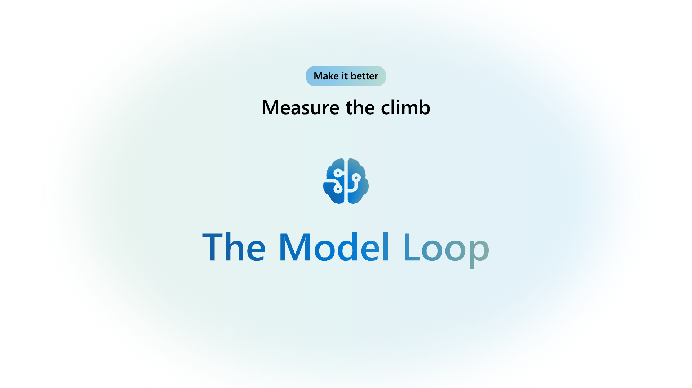

<!-- Image description: Section divider titled "Make it better" with the phrases "Measure the climb" and "The Model Loop." -->

<!--
Speaker notes:

Timing: ~0:20 | Cumulative: ~12:55

Presenter guidance: Keep this as a quick, thoughtful transition. Pause after "take a step."

Now we know where we might start fixing. The tempting thing is to jump straight into the prompt and start tweaking. We've all done that. But before we take a step, we need an altimeter and a starting altitude. So we'll define what "good" looks like, score this starter agent as our baseline, and measure every change against the same bar. Now we're ready to enter the model loop.
-->

---

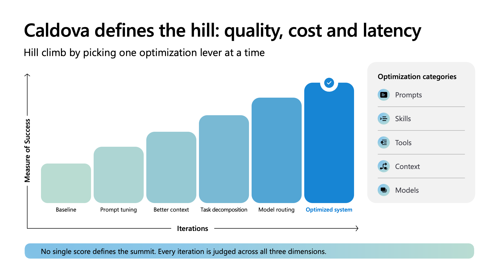

<!-- Image description: "Caldova defines the hill" diagram combining quality, cost, and latency targets with an iterative hill-climbing optimization path. -->

<!--
Speaker notes:

Timing: ~0:40 | Cumulative: ~13:35

Presenter guidance: Walk left to right across the hill. Emphasize that the picture is a method, not a promise that every step goes up.

So, quick recap. We built our first agent, gave it a bunch of questions, and Insights showed us where some of the trouble might be. And of course, there's more than one thing we could fix. Foundry gives us plenty of levers to try: prompts, skills, tools, context, and models. We'll see a couple of those in action later, including prompt tuning and model routing. But we don't pull every lever at once. We change one thing, measure what happened to quality, cost, and latency, and keep climbing one step at a time.
-->

---

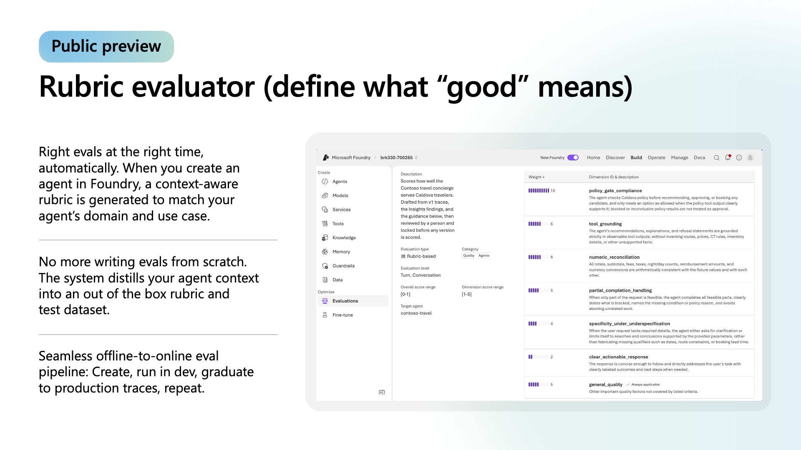

<!-- Image description: Rubric Evaluator overview describing automatic rubric generation and a consistent evaluation path from offline testing to online monitoring. -->

<!--
Speaker notes:

Timing: ~0:35 | Cumulative: ~14:10

Presenter guidance: Rubric Evaluator is currently preview. Point to the real Caldova dimensions in the screenshot. Emphasize the multidimensional rubric and its single trackable score.

So how do we build that altimeter? Foundry's Rubric Evaluator can look at the agent context and its traces, then propose the dimensions that matter for this job. Not one vague "quality" number, but policy compliance, tool use, correct numbers, clear answers—each with a weight we can review. Those dimensions roll up into one score we can track, while the detail underneath tells us why the score moved.
-->

---

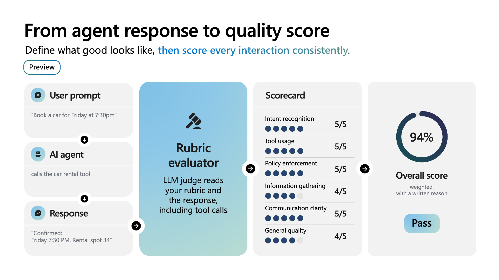

<!-- Image description: Example scorecard grading a response across weighted dimensions and combining the individual ratings into an overall quality score. -->

<!--
Speaker notes:

Timing: ~0:30 | Cumulative: ~14:40

Presenter guidance: Walk left to right. Emphasize consistency over pretending the score is absolute truth.

Now we just carry that altimeter with us and measure every stage of the climb. For each response, the evaluator scores the dimensions we care about—intent, tool use, policy, clarity—and rolls them into one weighted result, with a written reason we can inspect. The important part is that the instrument doesn't change. Same questions, same rubric, same judge. So when we change a prompt or a model, we can see whether we actually moved uphill—or whether we need to step back.
-->

---

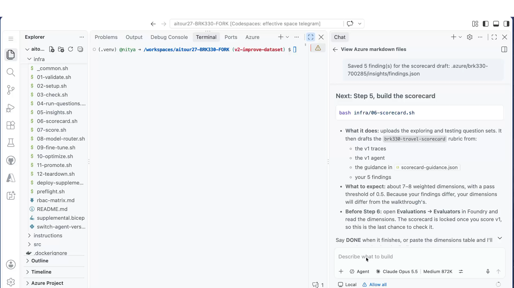

<!-- Image description: Visual Studio Code file explorer showing the numbered infrastructure scripts, deployment resources, and supporting documentation used in the workflow. -->

<!--
Speaker notes:

Timing: ~1:30 | Cumulative: ~16:10

Presenter guidance: Play `CLIP06-RUBRICS` and narrate over it. Use the added time to pause on the generated dimensions and invite the audience to sanity-check the weighting. The generated rubric still requires human review before use.

Play [CLIP06-RUBRICS](../videos/CLIP06-RUBRICS.mp4).

So, Copilot—can you help me scaffold that Rubric Evaluator? Yep. There we go. The traces are uploaded, Foundry reads the evidence, and suddenly we have a custom evaluator for this agent. Seven dimensions, one weighted score—and right at the top is policy-gate compliance. No surprise, right? Insights just showed us that issue across fifty-eight traces. We still review and tune it, but look how far we got without starting from scratch.
-->

---

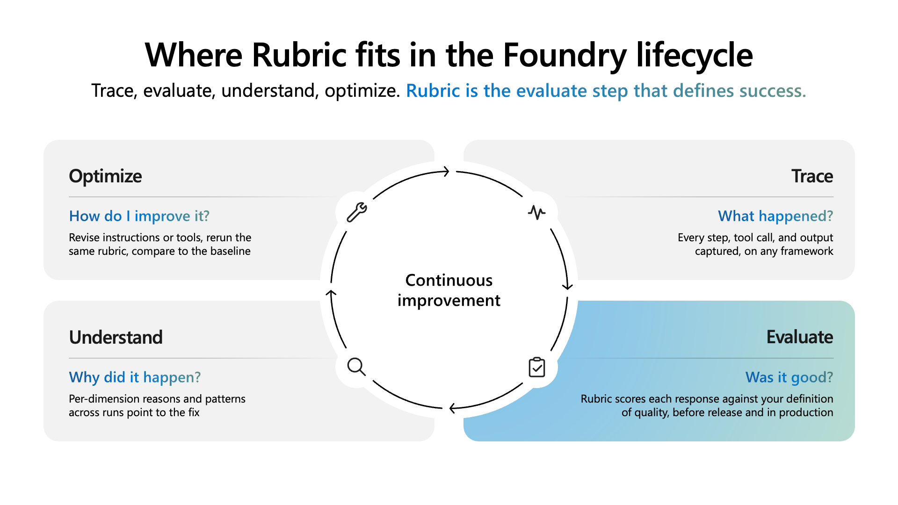

<!-- Image description: Microsoft Foundry lifecycle diagram showing a loop through tracing, understanding, optimizing, and evaluating with a shared rubric. -->

<!--
Speaker notes:

Timing: ~0:25 | Cumulative: ~16:35

Presenter guidance: Trace the loop clockwise, then land on the baseline evaluation as the next action.

Now the pieces come together. Traces tell us what happened. The rubric tells us whether it was good. The dimension scores help us understand why. Then we pick a change, optimize, and run the loop again. The rubric keeps us honest because we carry the same definition of success all the way around. All we need to do now is evaluate the current agent with this rubric.
-->

---

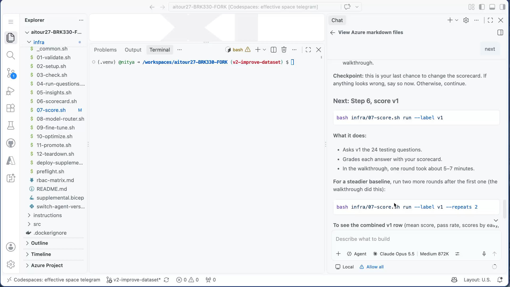

<!-- Image description: Terminal view walking through baseline checkpoint review and repeated scoring of the v1 agent. -->

<!--
Speaker notes:

Timing: ~2:10 | Cumulative: ~18:45

Presenter guidance: Play `CLIP07-SCORE` and narrate the setup and key drill-downs. Use the added time to compare one passing and one failing response, then leave the final scorecard visible for a beat.

Play [CLIP07-SCORE](../videos/CLIP07-SCORE.mp4).

Copilot, let's measure our starting altitude. It helps us run the evaluation three times—not because we're indecisive, but because agent behavior can vary from run to run. Averaging those rounds gives us a steadier baseline. As the results come in, we can open any response and see the rubric at full granularity. Here's one that passed, with the reasons behind each dimension. And here's one that failed, showing exactly where the behavior fell short. We finish with one scorecard that combines all three rounds. This is our starting point on the hill. Every step from here gets compared back to this.
-->

---

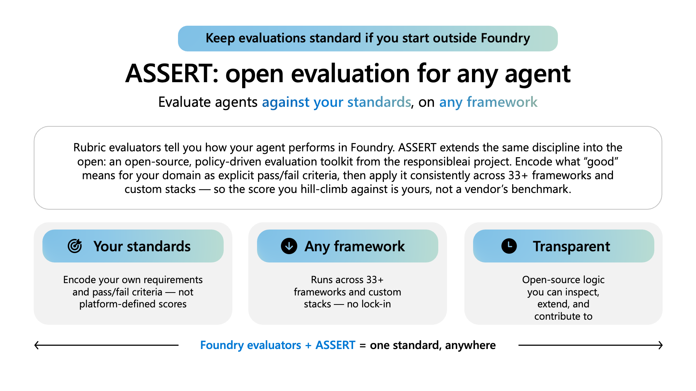

<!-- Image description: ASSERT evaluation framework overview highlighting broad framework support, reusable evaluation capabilities, and integration with Microsoft Foundry. -->

<!--
Speaker notes:

Timing: ~0:40 | Cumulative: ~19:25

Presenter guidance: Keep this as a brief portability point. The session uses Foundry, but the evaluation standard belongs to the customer.

One quick but important point: your agent does not have to start in Foundry for this discipline to work. Maybe it uses another framework, a custom stack, or a model running locally. ASSERT lets you define the rubric and carry that same measuring stick across more than thirty-three frameworks and custom environments. So the evaluation standard belongs to you. And if you later move into Foundry for production scale, that definition of "good" comes with you.
-->

---

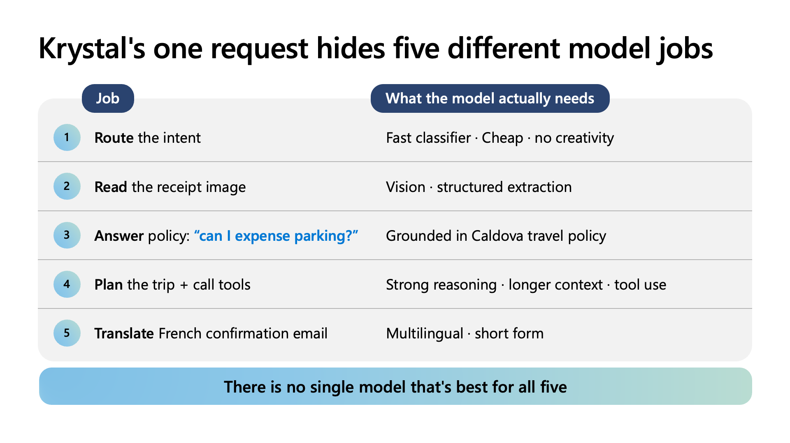

<!-- Image description: Table decomposing Krystal's request into five model jobs: route intent, read a receipt, answer policy, plan a trip, and translate an email. -->

<!--
Speaker notes:

Timing: ~0:35 | Cumulative: ~20:00

Presenter guidance: Don't read every row. Use two or three examples, then connect the policy finding to model choice as the next measured lever.

Our Insights and baseline both point us back to policy compliance. So let's chase that down—but this time, let's try model choice as the lever. Krystal's one request is really five different jobs. Some need fast, cheap classification. Some need vision. Policy needs careful grounding, and trip planning needs stronger reasoning and tool use. Right now, one frontier model does all of it. What if we let each job use the model that fits it best? Maybe we can improve the economics without giving up policy quality. We won't assume. We'll measure it.
-->

---

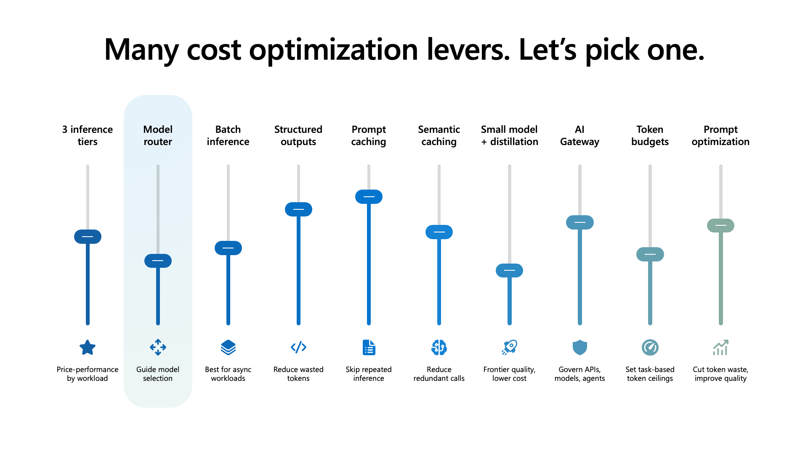

<!-- Image description: Matrix of model cost and performance levers including inference tiers, routing, batching, structured output, caching, distillation, gateways, budgets, and token reduction. -->

<!--
Speaker notes:

Timing: ~0:30 | Cumulative: ~20:30

Presenter guidance: Don't explain every lever. Point to the range, then highlight Model Router as the one controlled change.

There are plenty of levers here, but we said we'd pick one. And we did want to right-size our model strategy, right? Model Router can do that job. We keep one endpoint, and the router looks at each request and selects a model that fits—using lower-cost models where they're enough and stronger models where the work needs them. We change nothing else: same agent, same instructions, same tools. Then we run the same evaluation and compare it with our baseline. One clean step.
-->

---

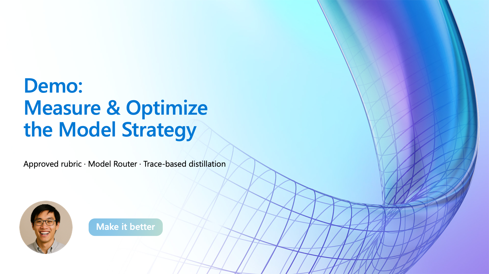

<!-- Image description: Demo divider titled "Measure & Optimize the Model Strategy" with three model-optimization activities listed beneath it. -->

<!--
Speaker notes:

Timing: ~0:15 | Cumulative: ~20:45

Presenter guidance: Keep this transition quick and energetic. Have `CLIP08-ROUTER-1` ready on the next slide.

All right, altimeter in hand. Let's climb. Our rubric is approved, our baseline is pinned, and now we'll try two model-strategy levers: Model Router and trace-based distillation. One change at a time, same scorecard every time. Let's see where the first step takes us.
-->

---

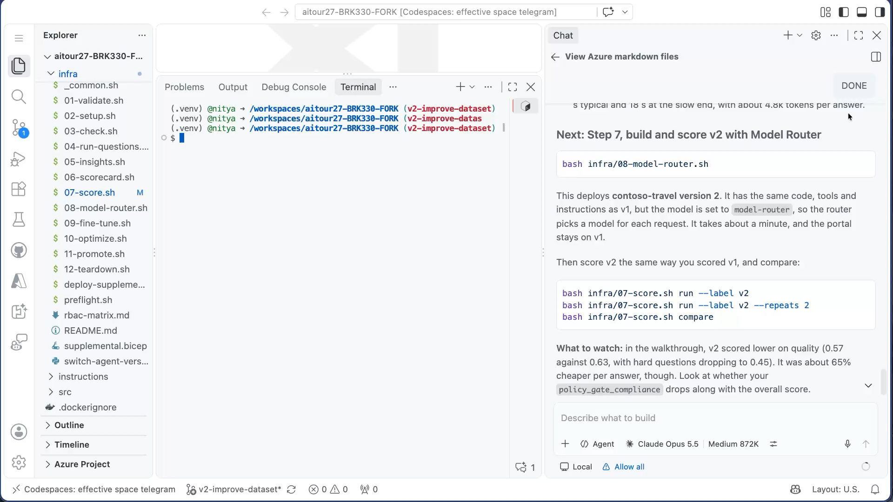

<!-- Image description: Terminal instructions for building Model Router v2 and comparing its expected quality and cost tradeoffs with the baseline. -->

<!--
Speaker notes:

Timing: ~1:40 | Cumulative: ~22:25

Presenter guidance: Play `CLIP08-ROUTER-1` and narrate over it. Use the added time to inspect the model mix and build excitement around the cost drop before revealing the quality result.

Play [CLIP08-ROUTER-1](../videos/CLIP08-ROUTER-1.mp4).

Copilot helps us deploy the default Model Router in balanced mode. Same agent, one endpoint—but now every request can be matched to a model that fits. And look at the traces: we're suddenly using a whole mix of models instead of sending everything to one frontier model. We run the evaluation twice so we're not making a decision from one noisy round. And yes—the cost drops. Great! Andre is going to like that. But then we check our altimeter. Quality? It barely moves. The router helped the economics, but it didn't solve the behavior we care about. And that is exactly why we measure every step.
-->

---

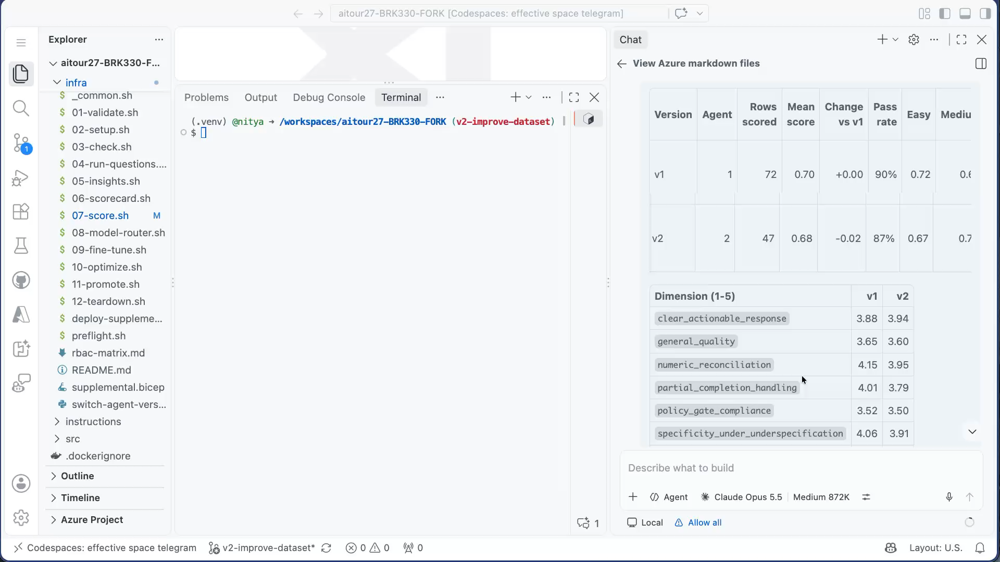

<!-- Image description: Comparison table for v1 and v2 showing overall score, pass rate, difficulty breakdowns, and quality dimensions. -->

<!--
Speaker notes:

Timing: ~1:30 | Cumulative: ~23:55

Presenter guidance: Play `CLIP08-ROUTER-2` and narrate over it. Use the added time to compare both router modes and let the quality gain feel promising before explaining why Caldova still declines promotion.

Play [CLIP08-ROUTER-2](../videos/CLIP08-ROUTER-2.mp4).

Balanced routing saved money, but quality didn't move enough. So we take another step: same Model Router, but this time we configure it to optimize for quality. And guess what? The score goes up. For a moment, that feels like a win. But when we compare it with Caldova's bar, it still isn't good enough to replace the production version. So we don't promote it. And that's the climb working exactly as it should. We tried something, measured it, and learned. The analysis is automated—but the decision to go live still belongs to a person.
-->

---

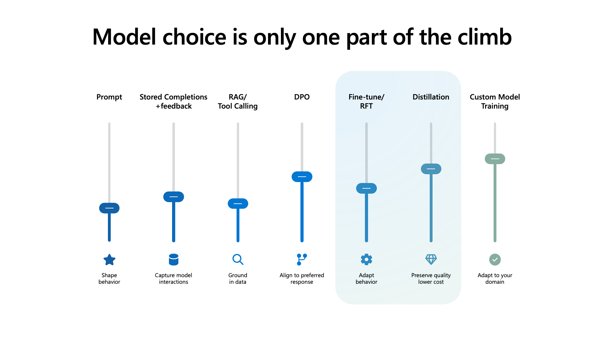

<!-- Image description: Horizontal spectrum of six optimization levers: prompts, caching, training, distillation, custom models, and domain adaptation. -->

<!--
Speaker notes:

Timing: ~0:30 | Cumulative: ~24:25

Presenter guidance: Don't explain every option. Introduce distillation as another quality-and-cost lever, then set up the decision criteria on the next slide.

Here are just a few more levers we could try. Distillation is a really interesting one. We can use our frontier model as the teacher and train a cheaper student model to do the same job. With a good teacher and good examples, that student can deliver similar quality for a lot less cost. The session repo includes a Copilot-built fine-tuning script if you want to try this yourself. But there's a catch: a student learns the teacher's mistakes too. So knowing when to use distillation matters just as much as knowing how.
-->

---

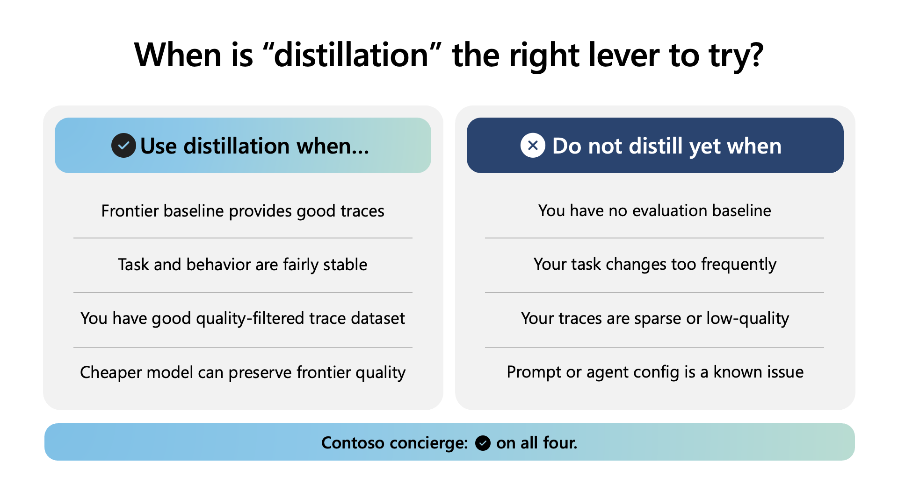

<!-- Image description: Decision matrix titled "When is distillation the right lever?" contrasting conditions that favor distillation with reasons to defer it. -->

<!--
Speaker notes:

Timing: ~0:35 | Cumulative: ~25:00

Presenter guidance: Don't read both columns. Contrast teaching a stable success with copying an unresolved problem, then point attendees to the session repo.

So, when does distillation make sense? It works best when we already have a strong teacher, a stable task, and plenty of good examples. But if the task keeps changing, the traces are weak, or we already know the prompt is the problem, we should fix that first. Otherwise, the student may simply learn the teacher's mistakes. Our concierge looks like a good candidate, so it's worth trying. And don't forget to check out the session repo for a Copilot-provided script that lets you try this lever yourself. But as always, test it before you trust it.
-->

---

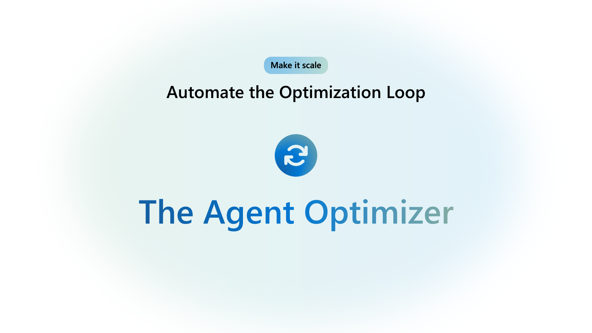

<!-- Image description: Section divider titled "Make it scale" with "Automate the Optimization Loop" and "The Agent Optimizer" highlighted. -->

<!--
Speaker notes:

Timing: ~0:35 | Cumulative: ~25:35

Presenter guidance: Use this as a conversational recap of the journey so far, then create the need for a more scalable optimization process.

All right, let's pause and look at how far we've come. Copilot helped us build and deploy the first agent. Traces showed us what it was really doing. Insights helped us spot the patterns behind its problems. Rubrics defined what good looks like and gave us an altimeter for the climb. Then we pulled an optimization lever, measured the result, and moved uphill. We made progress—but not enough. And repeating every experiment by hand won't scale. So how do we keep climbing? Let's meet Agent Optimizer.
-->

---

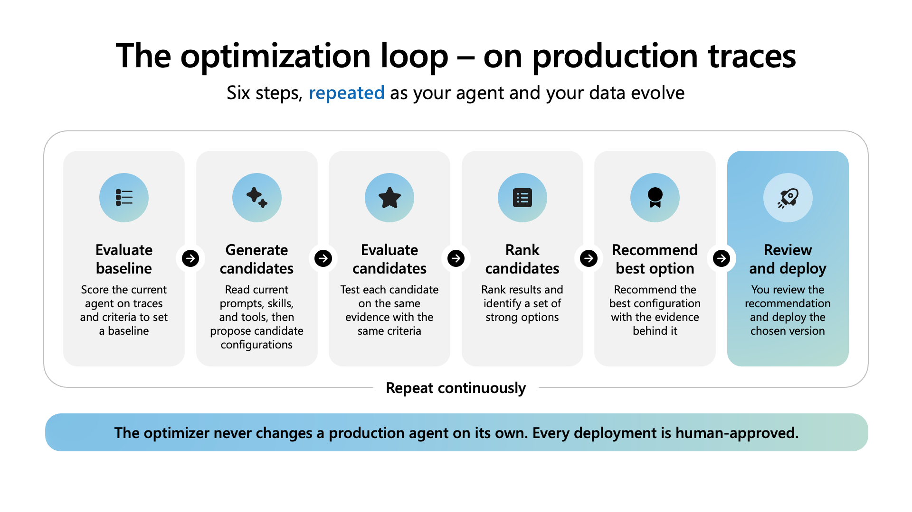

<!-- Image description: Six-step continuous optimization loop: evaluate a baseline, generate candidates, evaluate, rank, recommend, and repeat. -->

<!--
Speaker notes:

Timing: ~0:35 | Cumulative: ~26:10

Presenter guidance: Lead with production traces and the removal of manual experiment creation. Follow the diagram from left to right, then preserve human review at the end.

The most important thing to know is that Agent Optimizer works directly from your production traces. You don't have to create and test every experiment by hand. Just choose how many candidates you want, set the optimization targets, and let it do its thing. Here's how it works: it scores the current agent, creates new candidates, tests each one against the same evidence, ranks the results, and recommends the strongest option. As your agent and data change, you can run the loop again. We still review the evidence and decide what moves forward.
-->

---

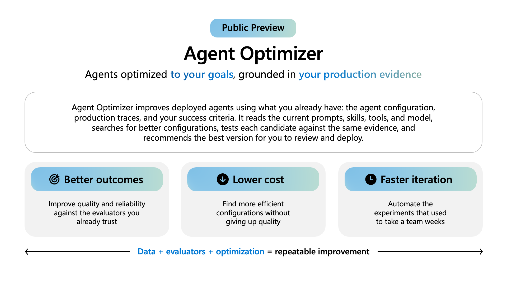

<!-- Image description: Agent Optimizer overview presenting data plus evaluators plus optimization as a way to improve quality, find efficient configurations, and automate experiments. -->

<!--
Speaker notes:

Timing: ~0:10 | Cumulative: ~26:20

Presenter guidance: Deliver only the punchline. Let the slide carry the supporting detail.

So what does this buy us? Better outcomes, lower cost, and faster iteration.
-->

---

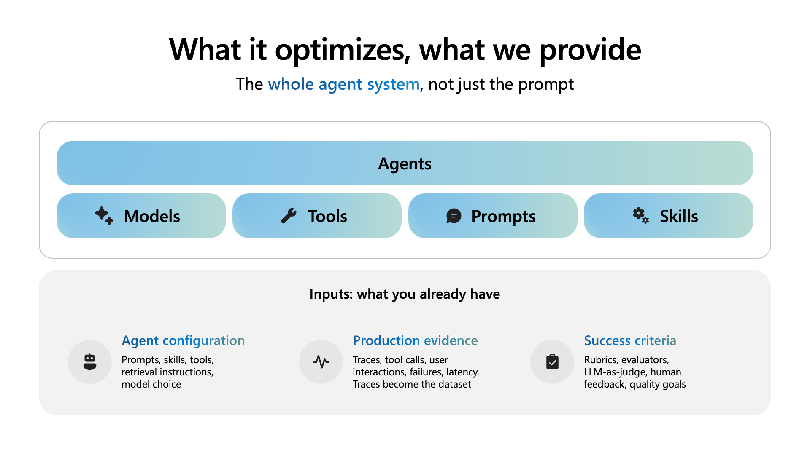

<!-- Image description: Input table for Agent Optimizer covering agent configuration, production traces, and success criteria such as rubrics and evaluators. -->

<!--
Speaker notes:

Timing: ~0:30 | Cumulative: ~26:50

Presenter guidance: Clarify that the demo optimizes the prompt for focus, while Agent Optimizer can use levers across the full agent system.

In the demo, we'll keep things focused and optimize the prompt. But that isn't the limit of Agent Optimizer. It can optimize across the whole agent system: prompts, tools, skills, retrieval, and even models. That's right—you can give it other model deployments from your project as additional levers to try. We provide the current agent configuration, the production traces, and our success criteria. Agent Optimizer can then explore those options and measure every candidate against the same bar.
-->

---

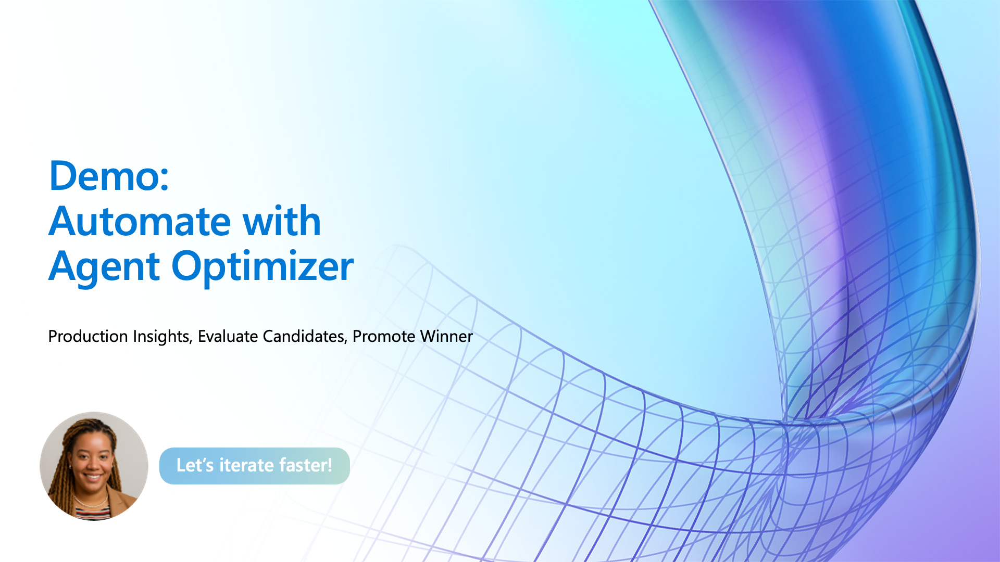

<!-- Image description: Demo divider titled "Automate with Agent Optimizer" with three demonstration steps listed beneath it. -->

<!--
Speaker notes:

Timing: ~0:10 | Cumulative: ~27:00

Presenter guidance: Keep this transition quick and have `CLIP10-OPTIMIZER` ready on the next slide.

Let's see it in action. Copilot creates the Agent Optimizer task, starts the run, and hands the work over to Foundry.
-->

---

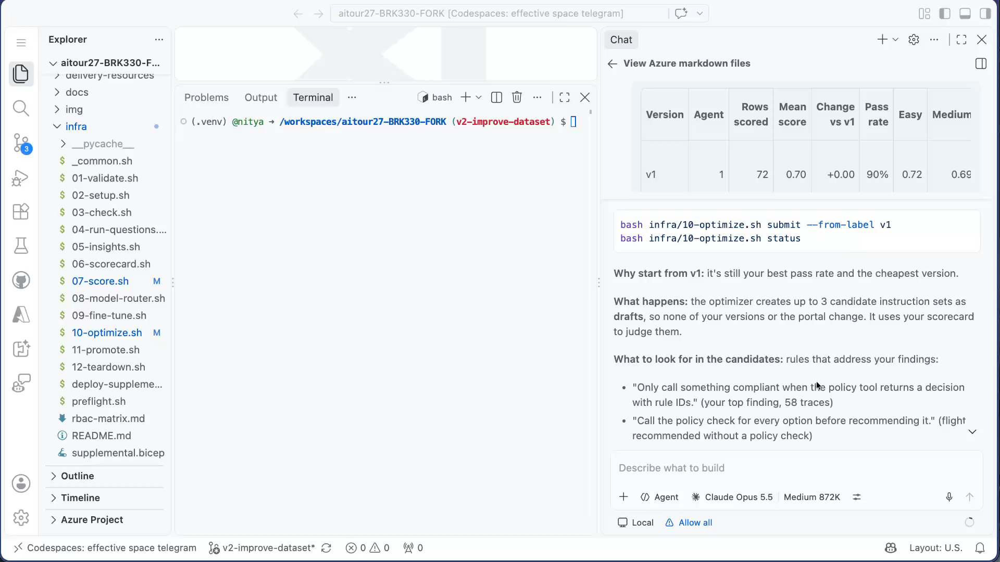

<!-- Image description: Terminal output from Agent Optimizer showing candidate instruction changes, findings addressed, and next steps for scoring v3. -->

<!--
Speaker notes:

Timing: ~3:00 | Cumulative: ~30:00

Presenter guidance: Play `CLIP10-OPTIMIZER` and narrate the candidate progression. Use the added time to pause after each candidate score, invite a quick audience prediction, and inspect the winning instruction change. The recorded path is edited; cloud execution time can vary.

Play [CLIP10-OPTIMIZER](../videos/CLIP10-OPTIMIZER.mp4).

Almost immediately, the job kicks off and the candidates begin taking the same test. The first candidate actually goes backward—and that's useful. Not every step in a hill climb goes up. The second does better, and then the third exceeds our expectations. We have a winner!

When we inspect the recommendation, we can see what changed. Agent Optimizer tightened the instructions, helping the agent handle those policy issues more effectively. We now have a candidate that clearly beats our starter agent.

But I'm curious: what happens if we combine these better instructions with Model Router? Could we improve the quality and the economics together? Let's find out.
-->

---

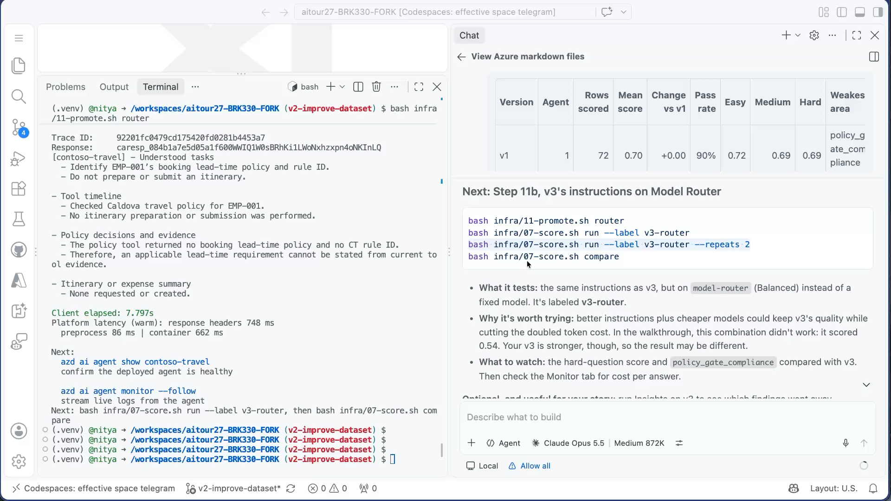

<!-- Image description: Terminal comparison of v1, v2, and v3 with response metrics and annotations about whether policy gates held. -->

<!--
Speaker notes:

Timing: ~3:10 | Cumulative: ~33:10

Presenter guidance: Play `CLIP11-OPTIMIZER-ROUTER` and narrate the final scorecard. Use the added time to let the summit result land, then clearly acknowledge the latency, token, and cost tradeoffs.

Play [CLIP11-OPTIMIZER-ROUTER](../videos/CLIP11-OPTIMIZER-ROUTER.mp4).

By now, the workflow feels familiar. Copilot deploys our optimized agent with Model Router, runs the evaluations again, and gives us the new scorecard.

And wow—this is our strongest version overall. Quality and pass rate both clear Caldova's target. Policy-gate compliance, the problem Insights uncovered earlier, is now well above the starter version. Latency has gone up slightly, so this isn't a free win. The agent also uses more tokens, but Model Router sends each job to a lower-cost, right-sized model—so the total cost still drops.

We didn't guess our way here. We followed the evidence, understood the tradeoffs, and kept the best results. We've reached the summit.
-->

---

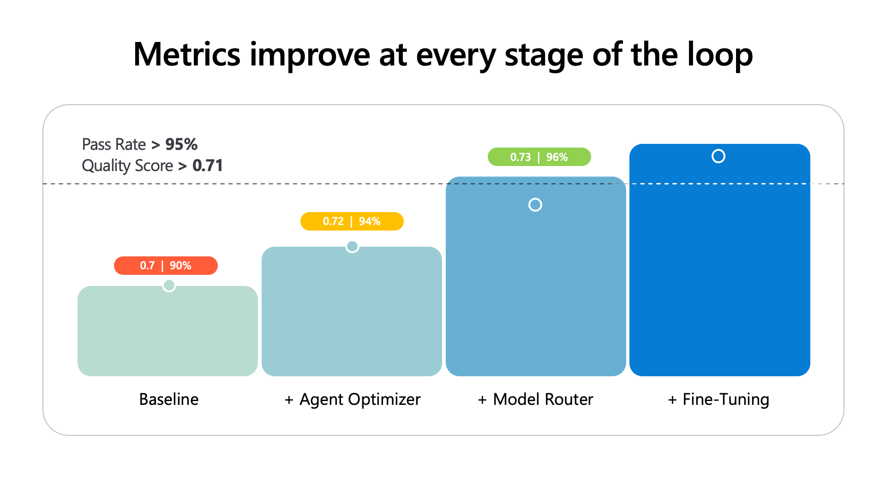

<!-- Image description: Progression chart comparing quality and pass-rate targets across the baseline, Agent Optimizer, Model Router, and fine-tuning stages. -->

<!--
Speaker notes:

Timing: ~0:40 | Cumulative: ~33:50

Presenter guidance: Walk left to right across the accepted climb. Mention the two earlier Model Router experiments as useful evidence, even though they were not promoted.

Let's step back and look at the whole journey. We started with v1 in production: a quality score of 0.70 and a 90 percent pass rate.

Next, we tried Model Router in balanced mode and quality mode. Both experiments gave us useful evidence, but neither improved the agent enough to replace our baseline.

Then Agent Optimizer created v3. Better instructions moved us to 0.72 and a 94 percent pass rate. Finally, we paired those optimized instructions with Model Router and reached 0.73 and 96 percent—above both targets.

That's hill climbing. Not every experiment gets promoted, but every result helps us choose the next step.
-->

---

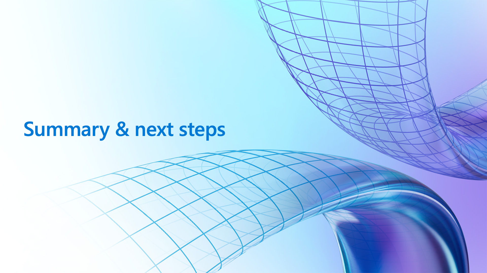

<!-- Image description: "Summary & next steps" section divider over abstract translucent blue and violet ribbon shapes. -->

<!--
Speaker notes:

Timing: ~0:15 | Cumulative: ~34:05

Presenter guidance: Use this as a brief transition from the completed climb into the stakeholder outcomes and reusable playbook.

We've reached the summit for this version of the agent. Now let's bring Krystal, Andre, and Lydia back into the story, see what changed for each of them, and turn this journey into a playbook you can use.
-->

---

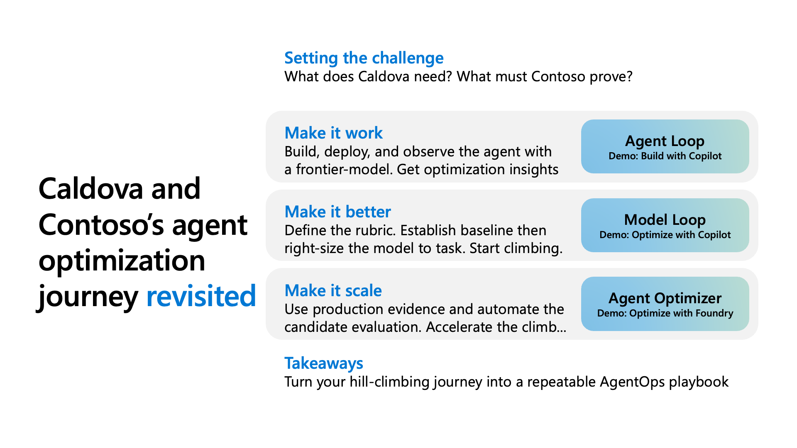

<!-- Image description: Journey recap linking the four optimization phases to their GitHub Copilot and Microsoft Foundry demonstrations and key takeaways. -->

<!--
Speaker notes:

Timing: ~1:10 | Cumulative: ~35:15

Presenter guidance: Use this as the detailed end-to-end recap. Close by returning to the three stakeholders and handing the story to Andre's economics.

Let's rewind the journey from the beginning.

Caldova gave Contoso a difficult challenge: build a concierge that works for Krystal, gives Andre a clear view of quality and cost, and gives Lydia an improvement process that can keep up with change.

First, we made the agent work. Copilot helped us build and deploy the first version. Production traces showed us what the agent was actually doing, and Insights turned those traces into patterns we could investigate.

Next, we made it better. Caldova defined the bar, Rubric Evaluator gave us an altimeter, and we measured the production agent as our baseline. We tried different model strategies, measured every result, and only kept the changes that moved us uphill.

Finally, we made the process scale. Agent Optimizer used our production evidence and the same rubric to create and test candidates automatically. It improved the instructions, and combining those instructions with Model Router took us beyond Caldova's target.

So, we made Krystal happy with a better, more reliable concierge. We made Lydia happy with a repeatable process that can keep improving. But what about Andre?
-->

---

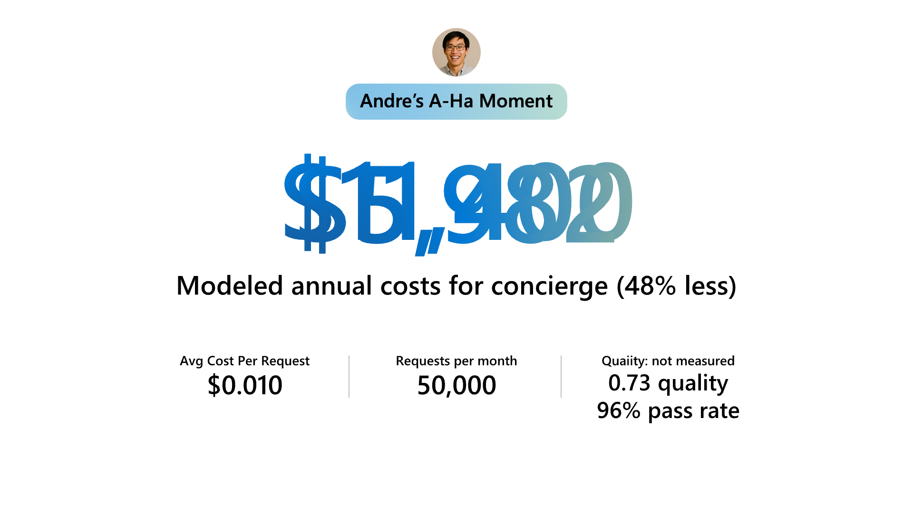

<!-- Image description: Andre's CFO "A-Ha Moment" showing a projected 48 percent cost reduction alongside per-request cost, volume, quality, and pass-rate metrics. -->

<!--
Speaker notes:

Timing: ~0:40 | Cumulative: ~35:55

Presenter guidance: Treat the financial figures as illustrative estimates based on the pricing and request volume shown in the deck. Emphasize that Andre now has evidence across cost, quality, and risk.

And this is Andre's aha moment. The modeled annual cost has been almost cut in half—from about $11,400 to $5,480.

But the bigger change is that cost no longer sits beside a question mark. Andre now has measurable quality: a 0.73 score and a 96 percent pass rate. And when we run Insights again, it shows that policy-gate compliance—the issue that concerned us from the beginning—has improved significantly.

So this isn't simply a cheaper agent. It's a better agent, with evidence that connects cost, quality, and risk. That's a business decision Andre can understand and defend.
-->

---

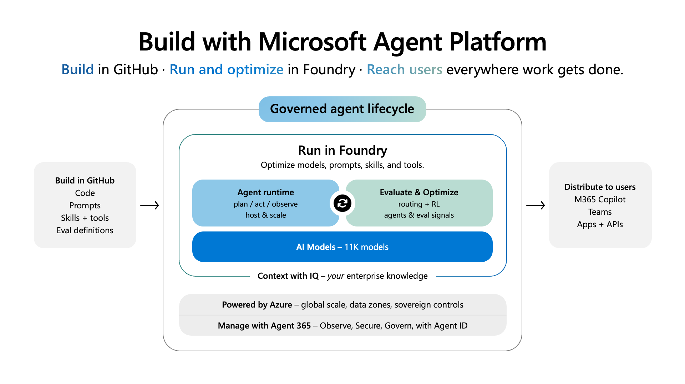

<!-- Image description: Microsoft Agent Platform architecture flowing from building in GitHub, to running in Foundry, to reaching users, with governance across the system. -->

<!--
Speaker notes:

Timing: ~1:05 | Cumulative: ~37:00

Presenter guidance: Follow the architecture from build, to run and optimize, to distribution. Keep the emphasis on one connected lifecycle rather than a list of products.

And Contoso is happy too. Their engineers delivered a working solution that satisfies Caldova's stakeholders, using Microsoft Foundry and GitHub Copilot across the full lifecycle.

Building with Copilot turned complex workflows—creating, deploying, evaluating, and promoting agents—into simple, repeatable prompts. Microsoft Foundry skills gave Copilot the platform knowledge needed to carry out those workflows correctly.

Running in Foundry gave the team the tools to understand and improve the agent: traces, Insights, evaluations, Model Router, and Agent Optimizer.

And when the agent is ready, distributing it across the places where people work is just a click away, with Azure providing enterprise scale and Agent 365 providing end-to-end security, visibility, and governance.

That's the platform story: build in GitHub, run and optimize in Foundry, and reach users everywhere.
-->

---

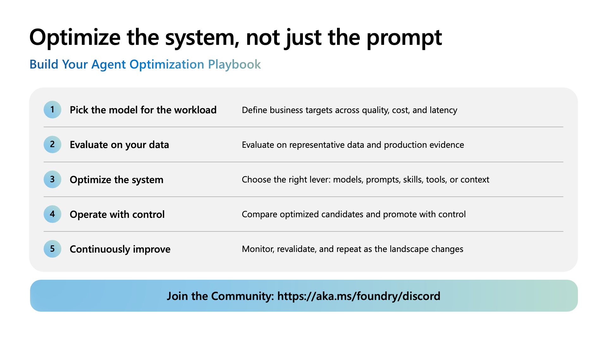

<!-- Image description: Five-step playbook titled "Optimize the system, not just the prompt," summarizing the repeatable optimization process. -->

<!--
Speaker notes:

Timing: ~0:45 | Cumulative: ~37:45

Presenter guidance: Walk through the five steps without reading the slide word for word. Keep human control and continuous improvement central.

If you remember one thing from today, let it be this: optimize the whole system, not just the prompt.

Start by choosing a sensible model for the workload and defining the business targets across quality, cost, and latency.

Evaluate the agent on your own representative data and production evidence—not a generic benchmark.

Then choose the lever that matches the problem. That might be the model, the instructions, a skill, a tool, or the context.

Compare every candidate against the same bar, and keep a person in control of what gets promoted.

Finally, keep monitoring and repeat the loop as your users, requirements, and models change. That's your agent optimization playbook.
-->

---

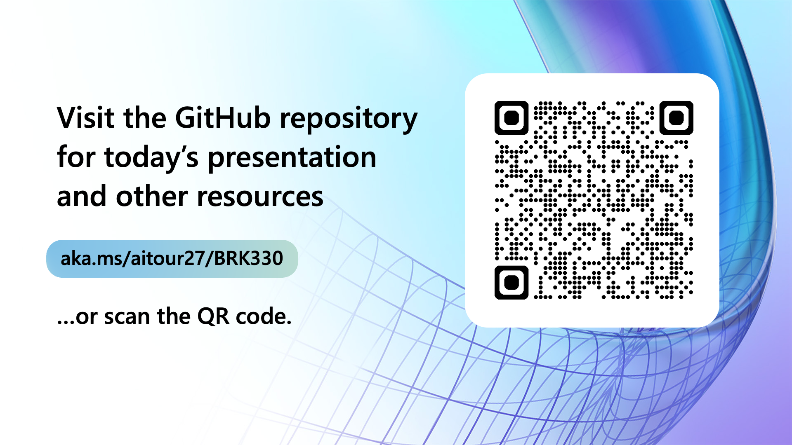

<!-- Image description: Closing call-to-action with a QR code and the URL aka.ms/aitour27/BRK330 for the session repository and resources. -->

<!--
Speaker notes:

Timing: ~0:25 | Cumulative: ~38:10

Presenter guidance: Leave the slide visible for scanning. Point attendees to both the QR code and the short URL.

Everything you saw today is available in the session repository: the agent, the walkthrough, the evaluation scripts, the demos, and the resources to try the climb yourself.

Scan the QR code or visit `aka.ms/aitour27/BRK330`. Start with your own agent, define what good looks like, gather the evidence, and take one measured step uphill.

Thank you for joining us.
-->
